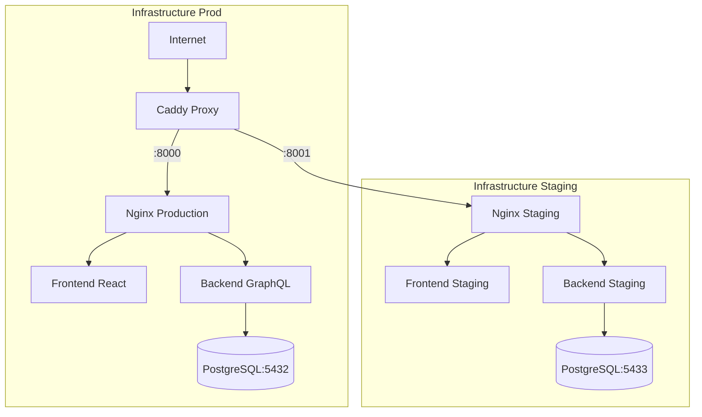

# 🚨 Ask&Trust - Plan de Reprise Après Incident (DRP)

**Document de Classification :** CONFIDENTIEL  
**Version :** 2.0  
**Dernière mise à jour :** 2025-01-17  
**Prochaine révision :** 2025-07-17  
**Responsable :** Équipe DevOps Ask&Trust

---

## 📋 Table des Matières

1. [🎯 Objectifs et Portée du Plan](#-objectifs-et-portée-du-plan)
2. [👥 Personnel et Contacts d'Urgence](#-personnel-et-contacts-durgence)
3. [🏗️ Profil d'Application et Infrastructure](#️-profil-dapplication-et-infrastructure)
4. [📊 Inventaire des Ressources Critiques](#-inventaire-des-ressources-critiques)
5. [⚡ Classification des Incidents](#-classification-des-incidents)
6. [🔄 Procédures de Sauvegarde](#-procédures-de-sauvegarde)
7. [🚨 Procédures de Reprise Après Incident](#-procédures-de-reprise-après-incident)
8. [🏠 Plan de Reprise Site Principal](#-plan-de-reprise-site-principal)
9. [🔥 Plan de Reprise Site de Secours (Hot Site)](#-plan-de-reprise-site-de-secours-hot-site)
10. [🔧 Restauration Complète du Système](#-restauration-complète-du-système)
11. [🏗️ Processus de Reconstruction](#️-processus-de-reconstruction)
12. [✅ Tests et Validation du Plan DRP](#-tests-et-validation-du-plan-drp)
13. [📝 Gestion des Modifications](#-gestion-des-modifications)
14. [📞 Annexes et Références](#-annexes-et-références)

---

## 🎯 Objectifs et Portée du Plan

### 🎯 Objectifs Majeurs

| **Objectif**                | **Description**                                   | **Délai Cible (RTO)** |
| --------------------------- | ------------------------------------------------- | --------------------- |
| **Continuité de Service**   | Maintenir les services Ask&Trust disponibles 24/7 | < 4 heures            |
| **Protection des Données**  | Aucune perte de données utilisateur (RPO)         | < 1 heure             |
| **Restauration Production** | Rétablir l'environnement de production complet    | < 8 heures            |
| **Communication**           | Informer toutes les parties prenantes             | < 30 minutes          |
| **Conformité Légale**       | Respecter GDPR et obligations réglementaires      | Immédiat              |

### 📊 Métriques de Performance

```
RTO (Recovery Time Objective) : 4 heures maximum
RPO (Recovery Point Objective) : 1 heure maximum
MTTR (Mean Time To Recovery) : 2 heures cible
Disponibilité Cible : 99.9% (8h46m d'indisponibilité/an)
```

### 🌐 Périmètre d'Application

**Services Couverts :**

- Application Ask&Trust (Production & Staging)
- Base de données PostgreSQL
- Infrastructure Docker/Nginx/Caddy
- Domaines : `092024-rouge-4.wns.wilders.dev`
- Données utilisateur et sondages

**Exclusions :**

- Environnements de développement local
- Services tiers (DockerHub, DNS externe)
- Infrastructure réseau WNS

---

## 👥 Personnel et Contacts d'Urgence

### 🚨 Équipe d'Intervention d'Urgence

| **Rôle**            | **Nom**     | **Téléphone**     | **Email**                | **Responsabilités**                        |
| ------------------- | ----------- | ----------------- | ------------------------ | ------------------------------------------ |
| **Responsable DRP** | [À DÉFINIR] | +33 X XX XX XX XX | drp-lead@askandtrust.dev | Coordination générale, décisions critiques |
| **Admin Système**   | [À DÉFINIR] | +33 X XX XX XX XX | sysadmin@askandtrust.dev | Infrastructure, serveurs, réseau           |
| **DBA**             | [À DÉFINIR] | +33 X XX XX XX XX | dba@askandtrust.dev      | Bases de données, sauvegardes              |
| **Dev Lead**        | [À DÉFINIR] | +33 X XX XX XX XX | dev-lead@askandtrust.dev | Applications, code, déploiements           |
| **Communication**   | [À DÉFINIR] | +33 X XX XX XX XX | comms@askandtrust.dev    | Communication externe, utilisateurs        |

### 📞 Contacts de Support

| **Service**       | **Contact**                | **Disponibilité** | **SLA** |
| ----------------- | -------------------------- | ----------------- | ------- |
| **WNS Hosting**   | support@wildcodeschool.com | 24/7              | 4h      |
| **DockerHub**     | support@docker.com         | 24/7              | 8h      |
| **Caddy Support** | Forum communautaire        | Business hours    | 24h     |

### 🔄 Escalade des Incidents

```
Niveau 1: Détection automatique → Astreinte technique (15 min)
Niveau 2: Échec récupération → Responsable DRP (30 min)
Niveau 3: Incident majeur → Direction + Communication (1h)
Niveau 4: Sinistre majeur → Toutes parties prenantes (2h)
```

---

## 🏗️ Profil d'Application et Infrastructure

### 🏛️ Architecture Ask&Trust



### 📊 Stack Technologique

| **Composant**        | **Technologie**   | **Version** | **Criticité** | **Dépendances** |
| -------------------- | ----------------- | ----------- | ------------- | --------------- |
| **Frontend**         | React + Vite      | 18.x        | CRITIQUE      | Nginx, Backend  |
| **Backend**          | Node.js + GraphQL | 20.x        | CRITIQUE      | PostgreSQL      |
| **Base de Données**  | PostgreSQL        | 15.x        | CRITIQUE      | Docker, Volume  |
| **Reverse Proxy**    | Nginx + Caddy     | Latest      | CRITIQUE      | Réseau          |
| **Conteneurisation** | Docker Compose    | Latest      | CRITIQUE      | Docker Engine   |
| **Orchestration**    | Docker Swarm      | N/A         | MOYEN         | -               |

### 🌐 Configuration Réseau

```bash
# Domaines et Ports
Production:     092024-rouge-4.wns.wilders.dev → :8000
Staging:        staging.092024-rouge-4.wns.wilders.dev → :8001
Operations:     ops.092024-rouge-4.wns.wilders.dev → :9000

# Services Internes
PostgreSQL Prod:    localhost:5432
PostgreSQL Staging: localhost:5433
Backend Prod:       container:3310
Backend Staging:    container:3310
```

---

## 📊 Inventaire des Ressources Critiques

### 💾 Serveurs et Infrastructure

| **Ressource**         | **Spécifications** | **Localisation**  | **Rôle**            | **Criticité** |
| --------------------- | ------------------ | ----------------- | ------------------- | ------------- |
| **Serveur Principal** | [SPECS À DÉFINIR]  | WNS Datacenter    | Production/Staging  | CRITIQUE      |
| **Docker Engine**     | Latest             | Serveur Principal | Conteneurisation    | CRITIQUE      |
| **Volumes Docker**    | SSD Local          | /var/lib/docker   | Persistance données | CRITIQUE      |

### 📁 Données et Volumes

```bash
# Volumes Docker Critiques
askandtrust-prod_db-data     → Base Production (CRITIQUE)
askandtrust-staging_db-data  → Base Staging (IMPORTANT)
askandtrust-prod_logs        → Logs Production (IMPORTANT)
askandtrust-staging_logs     → Logs Staging (NORMAL)

# Emplacements de Sauvegarde
~/backups/db/               → Sauvegardes locales
/external/backup/           → Sauvegardes externes (À CONFIGURER)
```

### 🔑 Certificats et Secrets

| **Secret**          | **Localisation**           | **Durée Validité** | **Propriétaire** |
| ------------------- | -------------------------- | ------------------ | ---------------- |
| **Certificats SSL** | Caddy Auto (Let's Encrypt) | 90 jours           | Caddy            |
| **DB Passwords**    | .env files                 | Permanent          | Admin Système    |
| **JWT Secrets**     | .env files                 | Permanent          | Dev Lead         |
| **API Keys**        | .env files                 | Variable           | Dev Lead         |

---

## ⚡ Classification des Incidents

### 🚨 Niveaux de Sévérité

| **Niveau**           | **Description**         | **Impact** | **Délai Response** | **Exemples**                |
| -------------------- | ----------------------- | ---------- | ------------------ | --------------------------- |
| **🔴 P1 - CRITIQUE** | Service indisponible    | Total      | 15 minutes         | Serveur down, DB corrompue  |
| **🟠 P2 - MAJEUR**   | Fonctionnalité dégradée | Partiel    | 1 heure            | API lente, erreurs 50x      |
| **🟡 P3 - MINEUR**   | Problème non-bloquant   | Minimal    | 4 heures           | Logs remplis, monitoring    |
| **🟢 P4 - INFO**     | Maintenance préventive  | Aucun      | 24 heures          | Mises à jour, optimisations |

### 🔍 Détection des Incidents

```bash
# Monitoring Automatique
# 1. Health Checks HTTP
curl -f https://092024-rouge-4.wns.wilders.dev/health

# 2. Monitoring Base de Données
docker exec askandtrust-prod-db-1 pg_isready

# 3. Monitoring Conteneurs
docker ps --filter "name=askandtrust-prod" --format "table {{.Names}}\t{{.Status}}"

# 4. Monitoring Ressources
free -h && df -h

# 5. Logs d'Erreur
tail -f ~/askandtrust-prod/apps/logs/error.log | grep -i error
```

### 📊 Matrice de Décision

```
Incident détecté → Auto-recovery (5 min) → Succès ? → FIN
                                        → Échec → Escalade Niveau 1
                                                → Réparation manuelle (30 min)
                                                → Succès ? → FIN
                                                → Échec → Escalade Niveau 2
                                                        → Activation DRP
```

---

## 🔄 Procédures de Sauvegarde

### 📅 Planning de Sauvegarde

| **Fréquence**     | **Contenu**      | **Rétention** | **Localisation** | **Responsable** |
| ----------------- | ---------------- | ------------- | ---------------- | --------------- |
| **Toutes les 6h** | DB Production    | 7 jours       | Local + Externe  | Automatique     |
| **Quotidien**     | DB + Configs     | 30 jours      | Local + Externe  | Automatique     |
| **Hebdomadaire**  | Système complet  | 3 mois        | Externe          | Manuel          |
| **Mensuel**       | Archive complète | 1 an          | Externe sécurisé | Manuel          |

### 🛠️ Scripts de Sauvegarde

#### Sauvegarde Base de Données Production

```bash
#!/bin/bash
# backup-prod-db.sh

DATE=$(date +%Y%m%d_%H%M%S)
BACKUP_DIR="/home/backup/db"
FILENAME="askandtrust_prod_${DATE}.sql"

# Création du répertoire
mkdir -p ${BACKUP_DIR}

# Sauvegarde
docker exec askandtrust-prod-db-1 pg_dump \
  -U ask_and_trust \
  -d ask_and_trust \
  --no-password \
  --clean \
  --if-exists > ${BACKUP_DIR}/${FILENAME}

# Compression
gzip ${BACKUP_DIR}/${FILENAME}

# Vérification
if [ $? -eq 0 ]; then
    echo "✅ Sauvegarde réussie: ${FILENAME}.gz"
    # Suppression des sauvegardes > 7 jours
    find ${BACKUP_DIR} -name "askandtrust_prod_*.sql.gz" -mtime +7 -delete
else
    echo "❌ Échec sauvegarde" >&2
    exit 1
fi
```

#### Sauvegarde Configuration Complète

```bash
#!/bin/bash
# backup-config.sh

DATE=$(date +%Y%m%d_%H%M%S)
BACKUP_DIR="/home/backup/config"
ARCHIVE="askandtrust_config_${DATE}.tar.gz"

mkdir -p ${BACKUP_DIR}

# Sauvegarde configurations
tar -czf ${BACKUP_DIR}/${ARCHIVE} \
  ~/askandtrust-prod/apps/ \
  ~/askandtrust-staging/apps/ \
  /etc/caddy/Caddyfile \
  ~/.docker/

echo "✅ Configuration sauvegardée: ${ARCHIVE}"
```

### 🔄 Automatisation des Sauvegardes

```bash
# Crontab configuration
# crontab -e

# Sauvegarde DB toutes les 6h
0 */6 * * * /home/scripts/backup-prod-db.sh >> /var/log/backup.log 2>&1

# Sauvegarde config quotidienne à 2h
0 2 * * * /home/scripts/backup-config.sh >> /var/log/backup.log 2>&1

# Nettoyage des logs anciens
0 1 * * 0 find /var/log -name "*.log" -mtime +30 -delete
```

### 🧪 Test de Restauration

```bash
#!/bin/bash
# test-restore.sh - Test mensuel de restauration

echo "🧪 Test de restauration DRP - $(date)"

# 1. Création d'un environnement de test
docker run -d --name test-db -p 5434:5432 \
  -e POSTGRES_DB=ask_and_trust \
  -e POSTGRES_USER=ask_and_trust \
  -e POSTGRES_PASSWORD=test_password \
  postgres:15

# 2. Restauration de la dernière sauvegarde
LATEST_BACKUP=$(ls -t /home/backup/db/askandtrust_prod_*.sql.gz | head -1)
gunzip -c ${LATEST_BACKUP} | docker exec -i test-db psql -U ask_and_trust -d ask_and_trust

# 3. Vérification
TABLES_COUNT=$(docker exec test-db psql -U ask_and_trust -d ask_and_trust -t -c "SELECT count(*) FROM information_schema.tables WHERE table_schema='public'")

if [ ${TABLES_COUNT} -gt 0 ]; then
    echo "✅ Test de restauration réussi: ${TABLES_COUNT} tables restaurées"
else
    echo "❌ Échec du test de restauration" >&2
fi

# 4. Nettoyage
docker stop test-db && docker rm test-db

echo "Test terminé - $(date)"
```

---

## 🚨 Procédures de Reprise Après Incident

### 🚀 Procédure d'Urgence - Redémarrage Rapide

```bash
#!/bin/bash
# emergency-restart.sh - Procédure P1

echo "🚨 PROCÉDURE D'URGENCE ACTIVÉE - $(date)"

# 1. Vérification de l'état actuel
echo "📊 État des services..."
systemctl status caddy
docker ps --filter "name=askandtrust-prod"

# 2. Arrêt propre des services
echo "🛑 Arrêt des services..."
cd ~/askandtrust-prod/apps
docker compose -f compose.prod.yml --project-name askandtrust-prod down

# 3. Vérification des volumes
echo "💾 Vérification des données..."
docker volume ls | grep askandtrust-prod

# 4. Redémarrage complet
echo "🚀 Redémarrage production..."
docker compose -f compose.prod.yml --project-name askandtrust-prod up -d

# 5. Tests de validation
echo "✅ Tests de validation..."
sleep 30
curl -f http://localhost:8000 || echo "❌ Frontend indisponible"
docker exec askandtrust-prod-db-1 pg_isready || echo "❌ Base de données indisponible"

# 6. Restart Caddy si nécessaire
sudo systemctl restart caddy

echo "🏁 Procédure d'urgence terminée - $(date)"
```

### 🔧 Procédure de Diagnostic Avancé

```bash
#!/bin/bash
# advanced-diagnostics.sh

echo "🔍 DIAGNOSTIC AVANCÉ - $(date)"

# 1. État système
echo "=== SYSTÈME ==="
free -h
df -h
uptime

# 2. État réseau
echo "=== RÉSEAU ==="
netstat -tulpn | grep -E "(8000|8001|5432|5433)"
curl -I https://092024-rouge-4.wns.wilders.dev

# 3. État Docker
echo "=== DOCKER ==="
docker system df
docker stats --no-stream
docker compose -f ~/askandtrust-prod/apps/compose.prod.yml ps

# 4. État base de données
echo "=== BASE DE DONNÉES ==="
docker exec askandtrust-prod-db-1 psql -U ask_and_trust -d ask_and_trust -c "SELECT count(*) FROM users;"
docker exec askandtrust-prod-db-1 psql -U ask_and_trust -d ask_and_trust -c "SELECT count(*) FROM surveys;"

# 5. Logs récents
echo "=== LOGS RÉCENTS ==="
tail -20 ~/askandtrust-prod/apps/logs/error.log
docker logs askandtrust-prod-backend-1 --tail 20

echo "🏁 Diagnostic terminé - $(date)"
```

### 📋 Checklist de Reprise

**✅ Phase 1 - Évaluation (0-15 min)**

- [ ] Identification de la cause racine
- [ ] Évaluation de l'impact
- [ ] Classification du niveau d'incident
- [ ] Notification de l'équipe d'astreinte

**✅ Phase 2 - Containment (15-30 min)**

- [ ] Isolation des systèmes affectés
- [ ] Activation du mode maintenance si nécessaire
- [ ] Sauvegarde d'urgence si possible
- [ ] Communication aux utilisateurs

**✅ Phase 3 - Éradication (30-120 min)**

- [ ] Correction de la cause racine
- [ ] Vérification de l'intégrité des données
- [ ] Tests en environnement staging
- [ ] Préparation de la restauration

**✅ Phase 4 - Récupération (Variable)**

- [ ] Restauration du service de production
- [ ] Validation fonctionnelle complète
- [ ] Monitoring renforcé
- [ ] Communication de la résolution

**✅ Phase 5 - Post-incident (24h-1 semaine)**

- [ ] Post-mortem détaillé
- [ ] Plan d'amélioration
- [ ] Mise à jour de la documentation
- [ ] Test des procédures de reprise

---

## 🏠 Plan de Reprise Site Principal

### 🔧 Scénario 1: Panne de Service Applicatif

```bash
# Symptômes: 502 Bad Gateway, API non responsive
# RTO: 30 minutes | RPO: 5 minutes

echo "🔧 Reprise service applicatif"

# 1. Diagnostic rapide
docker logs askandtrust-prod-backend-1 --tail 50
docker logs askandtrust-prod-frontend-1 --tail 50

# 2. Redémarrage sélectif
docker restart askandtrust-prod-backend-1
docker restart askandtrust-prod-frontend-1
docker restart askandtrust-prod-nginx-1

# 3. Validation
curl -f http://localhost:8000/api/graphql
curl -f http://localhost:8000
```

### 💾 Scénario 2: Corruption de Base de Données

```bash
# Symptômes: Erreurs DB, corruption détectée
# RTO: 2 heures | RPO: 6 heures max

echo "💾 Reprise base de données"

# 1. Arrêt immédiat du backend
docker stop askandtrust-prod-backend-1

# 2. Sauvegarde de l'état actuel
docker exec askandtrust-prod-db-1 pg_dump -U ask_and_trust ask_and_trust > /tmp/corrupted_db_$(date +%Y%m%d_%H%M%S).sql

# 3. Restauration de la dernière sauvegarde valide
LATEST_BACKUP=$(ls -t /home/backup/db/askandtrust_prod_*.sql.gz | head -1)
docker exec -i askandtrust-prod-db-1 psql -U ask_and_trust -d ask_and_trust -c "DROP SCHEMA public CASCADE; CREATE SCHEMA public;"
gunzip -c ${LATEST_BACKUP} | docker exec -i askandtrust-prod-db-1 psql -U ask_and_trust -d ask_and_trust

# 4. Redémarrage du backend
docker start askandtrust-prod-backend-1

# 5. Tests de validation
docker exec askandtrust-prod-db-1 psql -U ask_and_trust -d ask_and_trust -c "SELECT count(*) FROM users;"
```

### 🌐 Scénario 3: Panne Réseau/DNS

```bash
# Symptômes: Site inaccessible, DNS timeout
# RTO: 1 heure | RPO: 0

echo "🌐 Reprise réseau/DNS"

# 1. Tests de connectivité
ping -c 3 8.8.8.8
nslookup 092024-rouge-4.wns.wilders.dev

# 2. Vérification Caddy
sudo systemctl status caddy
sudo caddy validate --config /etc/caddy/Caddyfile

# 3. Redémarrage Caddy
sudo systemctl restart caddy

# 4. Tests locaux
curl -f http://localhost:8000
curl -f https://092024-rouge-4.wns.wilders.dev
```

---

## 🔥 Plan de Reprise Site de Secours (Hot Site)

### 🏗️ Architecture de Secours

**🎯 Objectif :** Site de secours opérationnel en < 4 heures

```bash
# Configuration Hot Site (À IMPLÉMENTER)
# Serveur de secours : backup.askandtrust.dev

# 1. Synchronisation des données
rsync -avz --delete ~/askandtrust-prod/ backup-server:~/askandtrust-prod/
rsync -avz --delete /home/backup/ backup-server:/home/backup/

# 2. Déploiement sur site de secours
ssh backup-server "cd ~/askandtrust-prod/apps && ./fetch-and-deploy-prod.sh"

# 3. Bascule DNS (À CONFIGURER)
# Update DNS A record: 092024-rouge-4.wns.wilders.dev → backup-server-ip
```

### 📋 Procédure de Bascule Hot Site

```bash
#!/bin/bash
# failover-to-hot-site.sh

echo "🔥 ACTIVATION SITE DE SECOURS - $(date)"

# 1. Notification immédiate
echo "🚨 SITE PRINCIPAL EN PANNE - BASCULE EN COURS"

# 2. Sauvegarde finale si possible
timeout 300 /home/scripts/backup-prod-db.sh || echo "⚠️ Sauvegarde finale échouée"

# 3. Synchronisation vers site de secours
rsync -avz --timeout=60 ~/askandtrust-prod/ backup-server:~/askandtrust-prod/
rsync -avz --timeout=60 /home/backup/ backup-server:/home/backup/

# 4. Activation du site de secours
ssh backup-server "cd ~/askandtrust-prod/apps && ./emergency-restart.sh"

# 5. Tests de validation
curl -f http://backup-server:8000 || echo "❌ Site de secours non disponible"

# 6. Bascule DNS (MANUEL pour l'instant)
echo "⚠️ MANUEL: Basculer DNS vers site de secours"
echo "A record: 092024-rouge-4.wns.wilders.dev → backup-server-ip"

echo "🏁 Bascule terminée - $(date)"
```

### 🔄 Procédure de Retour (Failback)

```bash
#!/bin/bash
# failback-to-primary.sh

echo "🔄 RETOUR SITE PRINCIPAL - $(date)"

# 1. Validation site principal
curl -f http://primary-server:8000 || exit 1

# 2. Synchronisation des données récentes
ssh backup-server "/home/scripts/backup-prod-db.sh"
rsync -avz backup-server:/home/backup/ /home/backup/

# 3. Restauration données récentes sur site principal
LATEST_BACKUP=$(ssh backup-server "ls -t /home/backup/db/askandtrust_prod_*.sql.gz | head -1")
scp backup-server:${LATEST_BACKUP} /tmp/
gunzip -c /tmp/$(basename ${LATEST_BACKUP}) | docker exec -i askandtrust-prod-db-1 psql -U ask_and_trust -d ask_and_trust

# 4. Tests de validation
docker exec askandtrust-prod-db-1 psql -U ask_and_trust -d ask_and_trust -c "SELECT count(*) FROM users;"

# 5. Bascule DNS retour (MANUEL)
echo "⚠️ MANUEL: Basculer DNS vers site principal"
echo "A record: 092024-rouge-4.wns.wilders.dev → primary-server-ip"

echo "🏁 Retour terminé - $(date)"
```

---

## 🔧 Restauration Complète du Système

### 🏗️ Reconstruction à Zéro

```bash
#!/bin/bash
# full-system-restore.sh
# Utilisation en cas de perte totale du serveur principal

echo "🏗️ RESTAURATION SYSTÈME COMPLÈTE - $(date)"

# PRÉREQUIS: Nouveau serveur avec Docker installé

# 1. Restauration de la structure
mkdir -p ~/askandtrust-prod/apps
mkdir -p ~/askandtrust-staging/apps
mkdir -p /home/backup/db
mkdir -p /home/backup/config

# 2. Récupération des configurations
# Depuis sauvegarde externe ou site de secours
rsync -avz backup-source:/home/backup/config/ /home/backup/config/
tar -xzf /home/backup/config/askandtrust_config_latest.tar.gz -C ~/

# 3. Installation des dépendances système
sudo apt update
sudo apt install -y curl postgresql-client

# 4. Configuration Caddy
sudo cp /home/backup/config/Caddyfile /etc/caddy/
sudo systemctl enable caddy
sudo systemctl start caddy

# 5. Déploiement des applications
cd ~/askandtrust-prod/apps
./fetch-and-deploy-prod.sh

cd ~/askandtrust-staging/apps
./fetch-and-deploy.sh

# 6. Restauration des données
LATEST_DB_BACKUP=$(ls -t /home/backup/db/askandtrust_prod_*.sql.gz | head -1)
gunzip -c ${LATEST_DB_BACKUP} | docker exec -i askandtrust-prod-db-1 psql -U ask_and_trust -d ask_and_trust

# 7. Tests complets
./advanced-diagnostics.sh

echo "🏁 Restauration complète terminée - $(date)"
```

### 📊 Checklist Restauration Complète

**✅ Phase 1 - Préparation (0-30 min)**

- [ ] Nouveau serveur provisionné
- [ ] Docker installé et configuré
- [ ] Accès réseau vérifié
- [ ] Sauvegardes récupérées

**✅ Phase 2 - Infrastructure (30-90 min)**

- [ ] Caddy installé et configuré
- [ ] DNS temporaire configuré
- [ ] Certificats SSL obtenus
- [ ] Firewall configuré

**✅ Phase 3 - Applications (90-180 min)**

- [ ] Conteneurs déployés
- [ ] Configuration vérifiée
- [ ] Bases de données restaurées
- [ ] Tests fonctionnels OK

**✅ Phase 4 - Validation (180-240 min)**

- [ ] Tests d'intégration complets
- [ ] Performance vérifiée
- [ ] Monitoring activé
- [ ] Utilisateurs notifiés

---

## 🏗️ Processus de Reconstruction

### 📊 Évaluation des Dommages

```bash
#!/bin/bash
# damage-assessment.sh

echo "📊 ÉVALUATION DES DOMMAGES - $(date)"

# 1. Évaluation Infrastructure
echo "=== INFRASTRUCTURE ==="
systemctl list-units --failed
docker system df
df -h

# 2. Évaluation Données
echo "=== DONNÉES ==="
docker exec askandtrust-prod-db-1 psql -U ask_and_trust -d ask_and_trust -c "\dt" 2>/dev/null || echo "❌ DB inaccessible"
ls -la ~/askandtrust-prod/apps/
ls -la /home/backup/db/

# 3. Évaluation Configuration
echo "=== CONFIGURATION ==="
sudo caddy validate --config /etc/caddy/Caddyfile 2>/dev/null || echo "❌ Caddy config invalide"
docker compose -f ~/askandtrust-prod/apps/compose.prod.yml config 2>/dev/null || echo "❌ Compose config invalide"

# 4. Évaluation Réseau
echo "=== RÉSEAU ==="
curl -f https://092024-rouge-4.wns.wilders.dev 2>/dev/null || echo "❌ Site inaccessible"
nslookup 092024-rouge-4.wns.wilders.dev

# 5. Rapport final
echo "=== RAPPORT ==="
echo "Timestamp: $(date)"
echo "Services affectés: [À COMPLÉTER MANUELLEMENT]"
echo "Données perdues: [À COMPLÉTER MANUELLEMENT]"
echo "Durée d'indisponibilité estimée: [À COMPLÉTER MANUELLEMENT]"

echo "🏁 Évaluation terminée - $(date)"
```

### 🎯 Plan de Reconstruction Progressive

**🔵 Phase 1 - Stabilisation (0-2h)**

```bash
# Objectif: Service minimal fonctionnel
1. Redémarrage des services critiques
2. Restauration de la dernière sauvegarde DB stable
3. Page de maintenance si nécessaire
4. Communication aux utilisateurs
```

**🟡 Phase 2 - Restauration (2-8h)**

```bash
# Objectif: Service complet restauré
1. Correction des causes racines
2. Restauration complète des données
3. Tests fonctionnels complets
4. Monitoring renforcé
```

**🟢 Phase 3 - Optimisation (8-24h)**

```bash
# Objectif: Performance et stabilité
1. Optimisation performance
2. Renforcement sécurité
3. Amélioration monitoring
4. Documentation mise à jour
```

---

## ✅ Tests et Validation du Plan DRP

### 📅 Planning des Tests

| **Type de Test**      | **Fréquence** | **Responsable**    | **Durée** | **Objectif**        |
| --------------------- | ------------- | ------------------ | --------- | ------------------- |
| **Test Sauvegarde**   | Hebdomadaire  | Admin Système      | 30 min    | Vérifier intégrité  |
| **Test Restauration** | Mensuel       | Équipe DRP         | 2 heures  | Vérifier procédures |
| **Simulation Panne**  | Trimestriel   | Équipe complète    | 4 heures  | Test complet        |
| **Test Hot Site**     | Semestriel    | Équipe + Direction | 1 jour    | Validation failover |

### 🧪 Test de Restauration Mensuel

```bash
#!/bin/bash
# monthly-drp-test.sh

echo "🧪 TEST DRP MENSUEL - $(date)"

# 1. Création environnement de test
docker network create drp-test-network
docker run -d --name drp-test-db --network drp-test-network \
  -e POSTGRES_DB=ask_and_trust \
  -e POSTGRES_USER=ask_and_trust \
  -e POSTGRES_PASSWORD=test_password \
  postgres:15

# 2. Test de restauration
LATEST_BACKUP=$(ls -t /home/backup/db/askandtrust_prod_*.sql.gz | head -1)
echo "Utilisation sauvegarde: ${LATEST_BACKUP}"

gunzip -c ${LATEST_BACKUP} | docker exec -i drp-test-db psql -U ask_and_trust -d ask_and_trust

# 3. Validation des données
USERS_COUNT=$(docker exec drp-test-db psql -U ask_and_trust -d ask_and_trust -t -c "SELECT count(*) FROM users")
SURVEYS_COUNT=$(docker exec drp-test-db psql -U ask_and_trust -d ask_and_trust -t -c "SELECT count(*) FROM surveys")

echo "✅ Utilisateurs restaurés: ${USERS_COUNT}"
echo "✅ Sondages restaurés: ${SURVEYS_COUNT}"

# 4. Test de performance
START_TIME=$(date +%s)
docker exec drp-test-db psql -U ask_and_trust -d ask_and_trust -c "SELECT * FROM users LIMIT 100" > /dev/null
END_TIME=$(date +%s)
DURATION=$((END_TIME - START_TIME))

echo "✅ Performance requête: ${DURATION}s"

# 5. Nettoyage
docker stop drp-test-db && docker rm drp-test-db
docker network rm drp-test-network

# 6. Rapport
cat << EOF > /home/reports/drp_test_$(date +%Y%m%d).md
# Test DRP - $(date)

## Résultats
- ✅ Restauration DB: OK
- ✅ Données: ${USERS_COUNT} users, ${SURVEYS_COUNT} surveys
- ✅ Performance: ${DURATION}s
- ✅ Procédures: OK

## Actions
- Prochaine révision: $(date -d "+1 month" +%Y-%m-%d)
EOF

echo "🏁 Test DRP terminé - $(date)"
```

### 🔥 Simulation de Sinistre Trimestrielle

```bash
#!/bin/bash
# quarterly-disaster-simulation.sh

echo "🔥 SIMULATION SINISTRE TRIMESTRIELLE - $(date)"

# ATTENTION: Test en environnement staging uniquement

# 1. Arrêt simulé du staging
cd ~/askandtrust-staging/apps
docker compose -f compose.staging.yml --project-name askandtrust-staging down

# 2. "Corruption" simulée (renommage)
docker volume ls | grep askandtrust-staging-db-data
mv /var/lib/docker/volumes/askandtrust-staging_db-data /var/lib/docker/volumes/askandtrust-staging_db-data.corrupted

# 3. Activation procédures DRP
./emergency-restart.sh

# 4. Mesure du temps de reprise
START_TIME=$(date +%s)

# Restauration depuis sauvegarde
LATEST_BACKUP=$(ls -t /home/backup/db/askandtrust_staging_*.sql.gz | head -1)
gunzip -c ${LATEST_BACKUP} | docker exec -i askandtrust-staging-db-1 psql -U ask_and_trust -d ask_and_trust

# Test de validation
curl -f http://localhost:8001 || echo "❌ Staging non fonctionnel"

END_TIME=$(date +%s)
RECOVERY_TIME=$((END_TIME - START_TIME))

echo "⏱️ Temps de reprise: ${RECOVERY_TIME}s (Objectif: < 14400s)"

# 5. Restauration état normal
docker compose -f compose.staging.yml --project-name askandtrust-staging down
mv /var/lib/docker/volumes/askandtrust-staging_db-data.corrupted /var/lib/docker/volumes/askandtrust-staging_db-data
docker compose -f compose.staging.yml --project-name askandtrust-staging up -d

echo "🏁 Simulation terminée - $(date)"
```

---

## 📝 Gestion des Modifications

### 📋 Processus de Mise à Jour du Plan

| **Déclencheur**           | **Responsable** | **Délai**  | **Approbation** |
| ------------------------- | --------------- | ---------- | --------------- |
| Changement infrastructure | Admin Système   | 48h        | Responsable DRP |
| Nouveau service           | Dev Lead        | 1 semaine  | Équipe DRP      |
| Incident majeur           | Équipe DRP      | 2 semaines | Direction       |
| Révision planifiée        | Responsable DRP | 1 mois     | Direction       |

### 📊 Journal des Modifications

```markdown
## 📅 Historique des Versions

### Version 2.0 - 2025-01-17

- **Ajout**: Procédures Hot Site
- **Amélioration**: Scripts d'automatisation
- **Correction**: Temps de récupération DB
- **Responsable**: YohanGH

### Version 1.5 - 2024-12-15

- **Ajout**: Tests automatisés
- **Amélioration**: Documentation procédures
- **Responsable**: Équipe DevOps

### Version 1.0 - 2024-10-01

- **Création**: Plan DRP initial
- **Responsable**: Équipe DevOps
```

### 🔄 Processus de Révision

```bash
#!/bin/bash
# drp-review-reminder.sh

# Script à exécuter mensuellement via cron

LAST_UPDATE=$(stat -c %y "server/Disaster-recovery-plant.MD" | cut -d' ' -f1)
CURRENT_DATE=$(date +%Y-%m-%d)
DAYS_SINCE=$(( ($(date -d "$CURRENT_DATE" +%s) - $(date -d "$LAST_UPDATE" +%s)) / 86400 ))

if [ $DAYS_SINCE -gt 90 ]; then
    echo "⚠️ ALERTE: Plan DRP non mis à jour depuis ${DAYS_SINCE} jours"
    echo "Action requise: Révision du plan DRP"
    # Envoyer notification à l'équipe
fi
```

---

## 📞 Annexes et Références

### 🔗 Liens Utiles

- **Monitoring Uptime**: [À CONFIGURER]
- **Status Page**: [À CONFIGURER]
- **Documentation Technique**: https://github.com/askandtrust/docs
- **Runbooks**: `/home/scripts/runbooks/`

### 📊 Métriques de Performance

```bash
# Métriques à surveiller
- Uptime: 99.9% minimum
- Response Time: < 2s moyenne
- Database Response: < 500ms
- CPU Usage: < 80% moyenne
- Memory Usage: < 85% moyenne
- Disk Usage: < 90% maximum
```

### 📋 Templates d'Incident

#### Communication Incident Majeur

```
🚨 INCIDENT MAJEUR - Ask&Trust

Statut: [EN COURS/RÉSOLU]
Impact: [SERVICE COMPLET/PARTIEL/DÉGRADÉ]
Début: [TIMESTAMP]
Résolution estimée: [TIMESTAMP]

Description:
[DESCRIPTION DE L'INCIDENT]

Actions en cours:
- [ACTION 1]
- [ACTION 2]

Prochaine mise à jour: [TIMESTAMP]

Contact: drp-lead@askandtrust.dev
```

### 🔧 Scripts d'Urgence

**Localisation**: `/home/scripts/emergency/`

```bash
emergency-restart.sh        → Redémarrage complet
advanced-diagnostics.sh     → Diagnostic détaillé
backup-emergency.sh         → Sauvegarde d'urgence
failover-to-hot-site.sh    → Bascule site secours
damage-assessment.sh        → Évaluation dommages
```

---

## 📈 Indicateurs de Performance DRP

### 🎯 KPI de Reprise

| **Indicateur**    | **Objectif** | **Actuel**  | **Tendance** |
| ----------------- | ------------ | ----------- | ------------ |
| **RTO Moyen**     | < 4h         | [À MESURER] | [À SUIVRE]   |
| **RPO Moyen**     | < 1h         | [À MESURER] | [À SUIVRE]   |
| **MTTR**          | < 2h         | [À MESURER] | [À SUIVRE]   |
| **Disponibilité** | 99.9%        | [À MESURER] | [À SUIVRE]   |
| **Tests DRP**     | 100% succès  | [À MESURER] | [À SUIVRE]   |

### 📊 Rapport Mensuel DRP

```bash
#!/bin/bash
# monthly-drp-report.sh

cat << EOF > /home/reports/drp_monthly_$(date +%Y%m).md
# Rapport DRP Mensuel - $(date +%B %Y)

## Incidents du Mois
- Nombre total: [À COMPLÉTER]
- P1 (Critiques): [À COMPLÉTER]
- P2 (Majeurs): [À COMPLÉTER]
- Temps de résolution moyen: [À COMPLÉTER]

## Tests et Validations
- Tests de sauvegarde: [OK/NOK]
- Test de restauration: [OK/NOK]
- Mise à jour documentation: [OK/NOK]

## Actions d'Amélioration
- [ACTION 1]
- [ACTION 2]

## Prochaines Échéances
- Prochain test trimestriel: $(date -d "+1 month" +%Y-%m-%d)
- Révision annuelle: $(date -d "+6 months" +%Y-%m-%d)

EOF
```

---

**🔒 FIN DU DOCUMENT - CONFIDENTIEL**

_Ce plan de reprise après incident est un document confidentiel de Ask&Trust. Sa diffusion est strictement limitée aux personnes autorisées. Toute reproduction ou divulgation non autorisée est interdite._

**Prochaine révision obligatoire : 2025-07-17**

---

_Maintenu par l'équipe DevOps Ask&Trust - Version 2.0_
